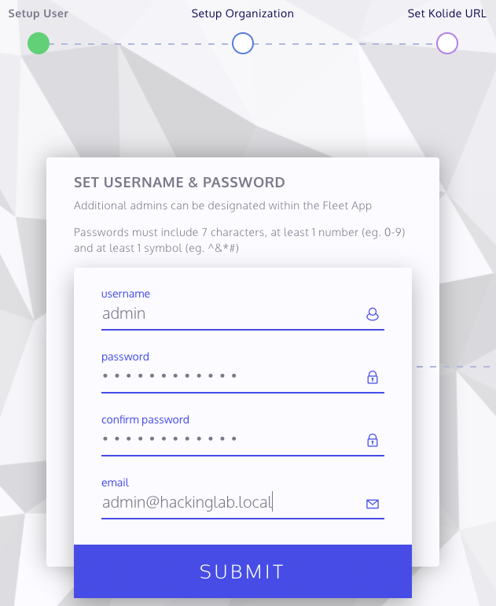
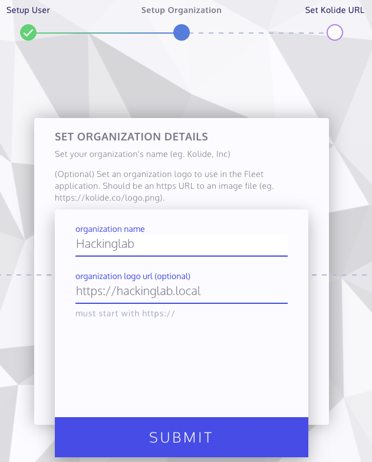
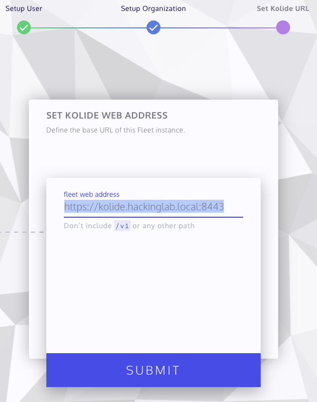
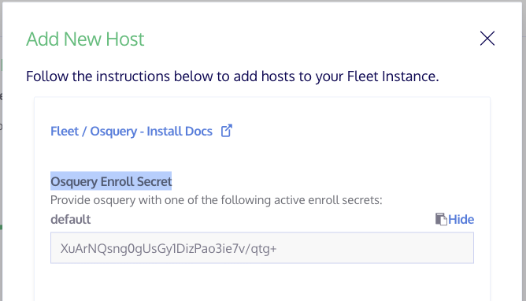

# Kolide + Osquery docs

## Init Kolide
1. Open a browser to `https://<Kolide FQDN>:8443/setup`
1. Setup user
  1. Enter `admin` for username
  1. Enter password
  1. Enter e-mail for admin
  1. Select submit
  1. 
1. Setup Organization
  1. Enter organization name
  1. Enter organization URL
  1. Select submit
  1. 
1. Setup Kolide URL
  1. Accept default
  1. Select Submit
  1. 
1. Select "Finish"

## Install Osquery 4.4.0 on Ubuntu 20.04
1. `export OSQUERY_KEY=1484120AC4E9F8A1A577AEEE97A80C63C9D8B80B`
1. `sudo apt-key adv --keyserver hkp://keyserver.ubuntu.com:80 --recv-keys $OSQUERY_KEY`
1. `sudo add-apt-repository 'deb [arch=amd64] https://pkg.osquery.io/deb deb main'`
1. `sudo apt-get update`
1. `sudo apt-get install osquery -y`
1. `wget https://raw.githubusercontent.com/CptOfEvilMinions/osquerey-file-carve-server/master/conf/osquery/osquery.flags -O /etc/osquery/osquery.flags`
1. `sed -i 's/kolide.hackinglab.local:8443/<FQDN or IP addr of Kolide:<port> /g' /etc/osquery/osquery.flags`
1. `scp <server cert> <user>@<ubuntu IP addr>:/etc/osquery/snakeoil.crt`

## Add Osquery host to Kolide
1. Login into Kolide
1. Select "Add New Host" in the top right
1. Select "Show" above the secret text box
1. Copy "Osquery Enroll Secret"
  1. 
1. SSH into VM with osquery
1. `echo '<osquery enroll secret>' > /etc/osquery/osquery.key`
1. `systemctl restart osqueryd`
1. Open a browser to `https://<Kolide FQDN>:8443/hosts/manage`

## Test query
1. Select new host via the Kolide webGUI
1. Query: `SELECT * FROM osquery_info`
1. Select "RUN"
1. Within a few seconds the results pane at the bottom should populate with results

## References
### Kolide
* [Configuring The Fleet Binary](https://github.com/kolide/fleet/blob/master/docs/infrastructure/configuring-the-fleet-binary.md)
* [Kolide Fleet – Breaking out the osquery API & Web UI](https://defensivedepth.com/2020/04/02/kolide-fleet-breaking-out-the-osquery-api-web-ui/)
* 
* 
* 
